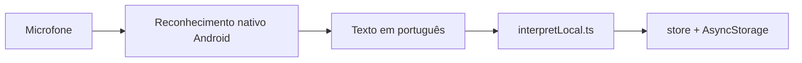
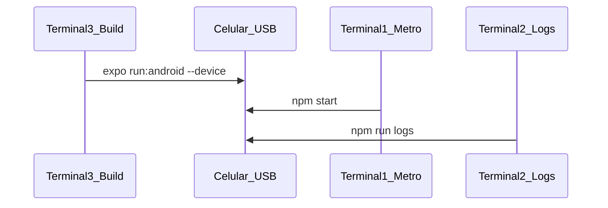

# DuDia

App Android para feirantes registrarem vendas e controlarem estoque na banca, com foco em **voz** ou **toque**. Tudo roda no celular: dados e interpretação dos comandos de voz ficam no aparelho, sem depender de internet para entender o que você falou.



**Nota:** o reconhecimento de fala usa o motor do Android (em alguns aparelhos pode usar rede do Google). A **interpretação** do pedido (ex.: “vendi 5 reais de tomate”) é **local**, no código do app.

---

## Pré-requisitos

- Node.js 20+
- JDK 17+ e Android SDK (`ANDROID_HOME` configurado; `adb` no PATH)
- Celular Android com **depuração USB** (recomendado) ou emulador

Não é necessário Supabase, `.env` nem conta na nuvem.

O DuDia **não funciona no Expo Go** — é preciso instalar o build nativo no aparelho (microfone e voz).

---

## Desenvolvimento no celular (recomendado)

Fluxo com **três terminais**: Metro, logs e build nativo no celular conectado por USB.



### Setup (uma vez)

```bash
npm install
npx expo prebuild --platform android
```

No celular:

1. **Configurações** → **Sobre o telefone** → toque 7× em **Número da versão** (ativa modo desenvolvedor)
2. **Opções do desenvolvedor** → **Depuração USB** ativada
3. Conecte o cabo USB e autorize o computador quando o celular pedir

Confirme que o PC enxerga o aparelho:

```bash
adb devices
```

Deve aparecer uma linha com o serial do celular e status **`device`** (não `unauthorized` nem vazio).

### Os três terminais

Abra **três abas/terminais** na pasta do projeto:

| Terminal | Comando | Função |
|----------|---------|--------|
| **1** | `npm start` | Metro bundler — deixe rodando; recarrega JS no app (fast refresh) |
| **2** | `npm run logs` | Logs do Android (`ReactNative`, erros, `console`) |
| **3** | `npm run android` | Compila, instala e abre o app **no celular USB** |

Equivalente do terminal 3:

```bash
npx expo run:android --device
```

Atalho opcional (sem `verify-android-deps.js`):

```bash
npm run android:direct
```

**Quando usar o terminal 3 de novo?**

- Primeira instalação do DuDia no celular
- Depois de `prebuild`, mudança em dependências nativas (voz, câmera, etc.) ou na pasta `android/`

Para alterações só em telas e lógica JavaScript, basta o **terminal 1** (`npm start`) com o app já aberto no celular.

Na primeira execução, conceda **microfone** (voz) e **galeria/câmera** (foto de produto, se usar).

Se o Metro não conectar pelo USB, celular e PC na mesma rede Wi‑Fi costumam resolver; o `run:android` configura `adb reverse` automaticamente na maioria dos casos.

Se aparecer `http://localhost:8081`, isso é o endereço do **Metro bundler** em modo desenvolvimento (normal). O app depende dele para hot reload e debug JS.

**Logs sem o script:** se preferir, no terminal 2:

```bash
adb logcat -c && adb logcat '*:S' ReactNative:V ReactNativeJS:V Expo:V AndroidRuntime:E
```

---

## Rodar no emulador (alternativa)

Se preferir emulador em vez do celular físico:

1. Crie um AVD no Android Studio (ex.: `Medium_Phone_API_36.1`).
2. Setup (se ainda não fez): `npm install` e `npx expo prebuild --platform android`.
3. **Terminal emulador** — não use só `run:android` se o AVD crashar ao abrir no Linux:

```bash
npm run emu
```

Aguarde o Android ligar (`adb devices` → `emulator-5554` **device**).

4. **Terminal Metro:** `npm start`
5. **Terminal logs:** `npm run logs`
6. **Build:** `npx expo run:android` (sem `--device`)

### Emulador fecha com “quit before it finished opening”

Em PCs Linux com GPU NVIDIA + Intel, o modo GPU padrão pode dar **segmentation fault**. O `npm run emu` usa `-gpu swiftshader_indirect`.

No Android Studio: AVD Manager → editar o dispositivo → **Graphics: Software - GLES 2.0**.

---

## Gerar APK

### Gradle (local)

```bash
npx expo prebuild --platform android
cd android && ./gradlew assembleRelease
```

APK: `android/app/build/outputs/apk/release/app-release.apk`

Atalho (após o primeiro `prebuild`):

```bash
npm run build:apk
```

### EAS Build local

```bash
npm install -g eas-cli
eas build -p android --profile preview --local
```

### Instalar no celular

```bash
adb install caminho/para/app-release.apk
```

---

## Comandos de voz (exemplos)

Fale com clareza, em português. **Segure** o microfone enquanto fala e **solte** ao terminar.

### Vendas (vários itens numa frase)

Na aba **Vendas**, modo **Voz**, você pode listar vários produtos de uma vez:

- “dois coxinhas três pastéis um pão de queijo”
- “vendi 5 reais de tomate e 2 unidades de cebola”

Cada trecho entra no **pedido** (carrinho) antes de confirmar a venda.

| Intenção | Exemplo |
|----------|---------|
| Vender por valor | “vendi 5 reais de tomate” |
| Vender por quantidade | “meio quilo de banana”, “2 quilos de couve” |
| Saída de estoque | “tirar 2 de banana” (só na tela **Vendas**) |
| Ajuste negativo | “tirar 5 reais”, “menos 5” |
| Tutorial | “me ensine a vender” |

### Produtos (só entrada de estoque)

Na aba **Produtos**, o microfone **adiciona** estoque ou cadastra produto. **Não** registra venda nem **tira** estoque por voz.

| Intenção | Exemplo |
|----------|---------|
| Entrada de estoque | “adicionar 10 quilos de tomate”, “dois coxinhas” |
| Cadastrar | “cadastrar tomate 6 reais o quilo” |

Para **remover** estoque por voz, use a aba **Vendas** (“tirar 2 de banana”). Na lista de Produtos use os botões **+** / **−**.

Se o parser não entender, use o modo **Manual** na aba Vendas ou cadastre pelo formulário em Produtos.

---

## Funcionamento das telas

### Vendas

- Total do dia e número de vendas no topo.
- **Manual:** toque em **+** / **−** nos produtos para montar o pedido.
- **Voz:** segure o microfone, fale um ou vários itens na mesma frase, solte; entram no carrinho.
- **Vender** → checkout (Pix, crédito, débito, dinheiro com troco).
- **Pix:** informe tipo/chave, nome do recebedor e cidade; gere o QR Code com o total do pedido ou copie o código. Confira o recebimento no banco e toque em **Recebi o Pix** para registrar a venda e baixar o estoque. [Detalhes e testes do Pix estático](docs/pix-estatico.md).
- Estoque baixo aparece em destaque.

### Produtos

- Lista com preço, unidade (kg/un) e estoque.
- **+** / **−** e excluir produto.
- **Cadastrar:** nome, preço, unidade, estoque, foto opcional.
- Microfone só para **adicionar** estoque ou cadastrar (não remove estoque).

### Histórico

- Vendas agrupadas por dia (“Hoje” para o dia atual).
- Toque no dia → lista de vendas; toque na venda → itens e pagamento.

### Perfil

- Nome do feirante e da banca.
- Vibração e preferência de notificações.
- Guias de uso.
- **Sair:** duplo toque limpa todos os dados locais.

---

## Estrutura do projeto

| Pasta | Conteúdo |
|-------|----------|
| `app/` | Rotas Expo Router (thin wrappers que reexportam de `src/features`) |
| `src/features/<aba>/` | Uma pasta por aba: `screens/`, `components/`, `hooks/`, `logic/` |
| `src/components/ui/` | Design system (Button, Card, BottomSheet, Toast, etc.) |
| `src/theme/` | Tokens light/dark, `ThemeProvider`, `useTheme` |
| `src/lib/domain/` | Store (`useStore`, `store.*`) e helpers de vendas |
| `src/lib/voice/` | NLU local pt-BR (`interpretLocal`, `commands`, tutoriais) |
| `src/lib/storage/` | AsyncStorage + settings |
| `src/lib/utils/` | Feedback háptico, manipulação de imagens |
| `src/hooks/useSpeech.ts` | Microfone nativo |
| `src/types/` | Tipos compartilhados (`Product`, `Sale`, etc.) |
| `assets/` | Ícones, splash e branding |

Para agentes de IA, consulte [AGENTS.md](AGENTS.md) (e os aninhados em `app/`, `src/`, `src/features/`, `android/`).

---

## Scripts

| Comando | Descrição |
|---------|-----------|
| `npm start` | **Terminal 1** — Metro bundler (dev) |
| `npm run logs` | **Terminal 2** — logs do app no celular/emulador |
| `npm run android` | **Terminal 3** — build e instala no celular USB (`--device`) |
| `npm run android:direct` | Build/instala direto no device em 1 comando |
| `npx expo run:android --device` | Igual ao `npm run android` |
| `npm run prebuild:android` | Gera pasta `android/` (setup) |
| `npm run emu` | Inicia emulador (GPU segura no Linux) |
| `npm run build:apk` | APK release (após prebuild) |

---

## Troubleshooting: erro `chrome-sandbox` (Linux)

Se o Metro mostrar algo como:

```text
ERROR  An unknown error occurred while installing React Native DevTools...
chrome-sandbox ... owned by root and has mode 4755
```

isso é do **debugger desktop** do React Native (Chromium), **não** do app DuDia. O build e o APK podem ter funcionado normalmente.

Os scripts `npm start` e `npm run android` já definem `EXPO_UNSTABLE_HEADLESS=1`, o que evita baixar/executar esse binário. O debugger JS continua disponível no **navegador** (com Metro aberto, pressione `j` no terminal).

Para ver erros e `console.log` do app no celular, use o **terminal 2**: `npm run logs`.

Se você quiser a janela standalone do React Native DevTools (opcional), corrija o sandbox no cache (caminho pode mudar após atualização do RN):

```bash
SANDBOX="$HOME/.cache/dotslash/af/5aa55d5d0401a9f3a438c9deb082205f28e353/React Native DevTools-linux-x64/chrome-sandbox"
sudo chown root:root "$SANDBOX"
sudo chmod 4755 "$SANDBOX"
```

Nesse caso, remova `EXPO_UNSTABLE_HEADLESS=1` dos scripts em `package.json`.

---

## Checklist rápido (celular USB)

1. `adb devices` — celular listado como **device**
2. **Terminal 3** (só na 1ª vez ou mudança nativa): `npm run android`
3. **Terminal 1:** `npm start` (deixar aberto)
4. **Terminal 2:** `npm run logs` (deixar aberto)
5. Abrir o DuDia no celular e testar (voz, vendas, produtos)
